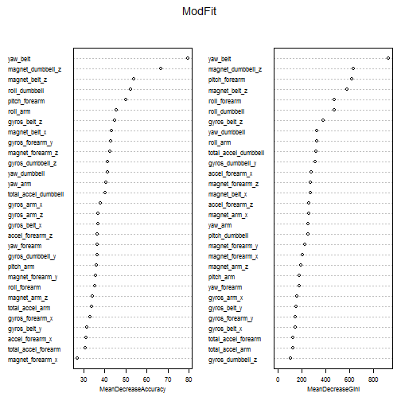

#### Executive Summary:
The goal of this exercise is to build a model to automatically predict how people perform some predetermined types of exercises. The model is : built using a **training data set** , cross validated with a **testing data set** and finally, executed only  once with a 3rd **test data set**.An **accuracy of 99%** was achieved with the model built, making it a reliable predicting tool in the current case.

#### I. Load libraries and data  
Preload all libraries and have a sneak preview of the data set 
 

```r
library(caret)
library(ggplot2)
library(randomForest)
library(e1071)
set.seed(1234)
data_trn <- read.csv("pml-training.csv", na.strings=c("", "NA", "NULL"))
data_tst <- read.csv("pml-testing.csv", na.strings=c("", "NA", "NULL"))
data_training<-data_trn 
data_testing<-data_tst 
```


####II.  Exploratory Data Analysis - (Streamlining)  

Once libraries and data loaded an dout of the way, the next step was to perform a measure of Exploratory Data Analysis to clean the data sets, identify variables, get information on data types, and so on.  
It was noted that  
- The dependent variable (**Classe**) is of type '*factor*' with 5 levels  
- There seems to be a lot of non available data (**NA**)  

The next phase was then to clean and prepare the data sets for computation. 


##### 1. Removing columns with "NA" and irrelevant variables (Column 1:7)


```r
#TRAINING Data Set
data_train <- data_training[ , colSums(is.na(data_training)) == 0]  # Keep columns where the sum of NA is Zero
data_train<- data_train[,-(1:7)] # Get rid of columns 1-7

#TEST Data Set
data_test <- data_testing[ , colSums(is.na(data_testing)) == 0]  
data_test<- data_test[,-(1:7)]
```

##### 2. Make the nearzero diagnosis

To further see if there are more candidates for removel , perform the "Nearzero" test.
(ref http://tgmstat.wordpress.com/2014/03/06/near-zero-variance-predictors/)


```r
nzv_train<- nearZeroVar(data_train, saveMetrics = TRUE)
nzv_train[nzv_train$nzv, ]
```

```
## [1] freqRatio     percentUnique zeroVar       nzv          
## <0 rows> (or 0-length row.names)
```

This diagnosis proposed **no candidate**(variable) for removal.  


The **PCA analysis** was also performed but later dropped from this assignment.  
I had an unknown programming problem which was taking too much time to solving.

##### 3. Remove highly correlated variables

Last step in the EDA was to get rid of the highly correlated variables.
There is a lot of discussion on this theme . One author (N.R.Draper and H.smith "Applied regression Analysis") notes that *".. the existence of intercorrelation may be an obstacle for interpretation"*.


```r
cor_train <- findCorrelation(cor(data_train[,-53]), cutoff = 0.75)
data_train<-data_train[,-cor_train]
data_test<-data_test[,-cor_train]
```


####III.  Split the Data set

The training data set **(data_training)** set was split in 2 :  
 - one set will used for training the model  
 - the 2nd set used to crossvalidate the model

A default 60/40 split was performed.


```r
# split the training data sets into 2 on a 60/40 basis
#
Sp_Index <- createDataPartition(y=data_train$classe, p=0.6, list=FALSE)   
training<- data_train[Sp_Index,]     # Put the 60% in this new data set.
testing<- data_train[-Sp_Index,]    # Put the remaining 40% in this new data set.
```


####IV.  Apply predicting with Random Forest

The **CARET** package was used to perform this *Random Forest* processing.


```r
ModFit <- randomForest(classe ~ ., data = training, importance = TRUE, ntrees = 500)
varImpPlot(ModFit, cex = 0.7)                         
```

 


**Gini** is defined as *"inequity"* or a measure of *"node impurity"* in tree-based classification.(ref. Course materila)  
A **low Gini** (i.e. higher decrease in Gini) means that a particular predictor variable plays a **greater** role in partitioning the data into the defined classes.
There is a clear visualisation of the **"important"** variables.


####V.  Cross validation and Accuracy testing

The **confusion matrix** was the applied to both the `*training*` and `*test*` set to check the **accuracy** of our model.

Result of the verification :  
 - Training set : **100% accurate** as expected  
 - Testing set : **>99% accurate**

The model has a good accuracy and can be confidently used.


```r
crossval<-predict(ModFit, training)
confusionMatrix(training$classe, predict(ModFit, training))
```

```
## Confusion Matrix and Statistics
## 
##           Reference
## Prediction    A    B    C    D    E
##          A 3348    0    0    0    0
##          B    0 2279    0    0    0
##          C    0    0 2054    0    0
##          D    0    0    0 1930    0
##          E    0    0    0    0 2165
## 
## Overall Statistics
##                                 
##                Accuracy : 1     
##                  95% CI : (1, 1)
##     No Information Rate : 0.284 
##     P-Value [Acc > NIR] : <2e-16
##                                 
##                   Kappa : 1     
##  Mcnemar's Test P-Value : NA    
## 
## Statistics by Class:
## 
##                      Class: A Class: B Class: C Class: D Class: E
## Sensitivity             1.000    1.000    1.000    1.000    1.000
## Specificity             1.000    1.000    1.000    1.000    1.000
## Pos Pred Value          1.000    1.000    1.000    1.000    1.000
## Neg Pred Value          1.000    1.000    1.000    1.000    1.000
## Prevalence              0.284    0.194    0.174    0.164    0.184
## Detection Rate          0.284    0.194    0.174    0.164    0.184
## Detection Prevalence    0.284    0.194    0.174    0.164    0.184
## Balanced Accuracy       1.000    1.000    1.000    1.000    1.000
```


```r
confusionMatrix(testing$classe, predict(ModFit, testing))
```

```
## Confusion Matrix and Statistics
## 
##           Reference
## Prediction    A    B    C    D    E
##          A 2232    0    0    0    0
##          B   10 1500    7    0    1
##          C    0   11 1342   15    0
##          D    0    0   19 1265    2
##          E    0    0    3    2 1437
## 
## Overall Statistics
##                                         
##                Accuracy : 0.991         
##                  95% CI : (0.989, 0.993)
##     No Information Rate : 0.286         
##     P-Value [Acc > NIR] : <2e-16        
##                                         
##                   Kappa : 0.989         
##  Mcnemar's Test P-Value : NA            
## 
## Statistics by Class:
## 
##                      Class: A Class: B Class: C Class: D Class: E
## Sensitivity             0.996    0.993    0.979    0.987    0.998
## Specificity             1.000    0.997    0.996    0.997    0.999
## Pos Pred Value          1.000    0.988    0.981    0.984    0.997
## Neg Pred Value          0.998    0.998    0.996    0.997    1.000
## Prevalence              0.286    0.193    0.175    0.163    0.184
## Detection Rate          0.284    0.191    0.171    0.161    0.183
## Detection Prevalence    0.284    0.193    0.174    0.164    0.184
## Balanced Accuracy       0.998    0.995    0.987    0.992    0.999
```

####VI.  The 20 files

 
 

```r
Result <- predict(ModFit,data_test[,-33])
answers<-Result[1:20]
answers
```

```
##  1  2  3  4  5  6  7  8  9 10 11 12 13 14 15 16 17 18 19 20 
##  B  A  B  A  A  E  D  B  A  A  B  C  B  A  E  E  A  B  B  B 
## Levels: A B C D E
```

```r
pml_write_files = function(x){
  n = length(x)
  for(i in 1:n){
    filename = paste0("problem_id_",i,".txt")
    write.table(x[i],file=filename,quote=FALSE,row.names=FALSE,col.names=FALSE)
  }
}

pml_write_files(answers)
```

 


 
